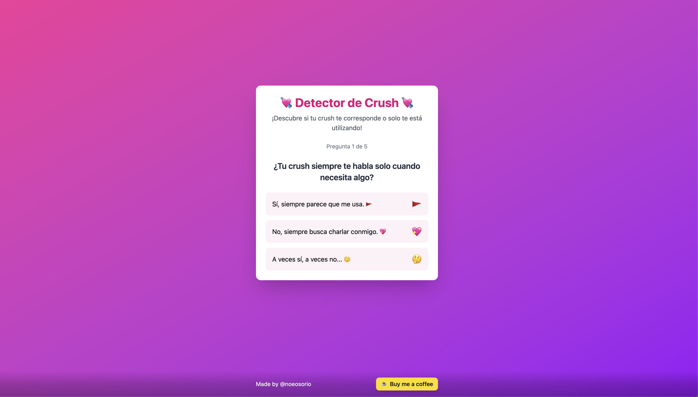

  <h1>💘 Crush App</h1>
  
¿Tu crush te corresponde o solo te está utilizando? ¡Descúbrelo con este test!

  [Ver Demo](https://crush.noeosorio.com) · 
  [Reportar Bug](https://github.com/NoeOsorio/crush-app/issues) · 
  [Sugerir Feature](https://github.com/NoeOsorio/crush-app/issues)

  
  
  
  

## 🎯 Sobre el Proyecto

Crush App es un test divertido que usa inteligencia artificial para analizar si tu crush está interesado en ti o solo te está dando falsas esperanzas. A través de preguntas dinámicas y un análisis humorístico, obtendrás un veredicto sobre tu situación amorosa.

## 🚀 Features

* **Preguntas Dinámicas**: Cada test es único gracias a la IA
* **Análisis Divertido**: Mensajes humorísticos mientras analizamos tus respuestas
* **Resultados Compartibles**: Comparte fácilmente tu veredicto con amigos
* **Diseño Moderno**: Interfaz atractiva y fácil de usar
* **100% Responsivo**: Funciona perfectamente en cualquier dispositivo

## 🎨 Preview

  

## 🤝 Contribuir

¿Quieres mejorar Crush App? ¡Toda contribución es bienvenida!

1. Haz fork del proyecto
2. Crea tu rama de feature (`git checkout -b feature/AmazingFeature`)
3. Haz commit de tus cambios (`git commit -m 'Add: AmazingFeature'`)
4. Push a la rama (`git push origin feature/AmazingFeature`)
5. Abre un Pull Request

## 👤 Author

**Noé Osorio**

* 🌐 Website: [noeosorio.com](https://noeosorio.com)
* 🐦 Twitter: [@noeosorio](https://twitter.com/noeosorio)
* 💼 LinkedIn: [noeosorioh](https://linkedin.com/in/noeosorioh)
* 📷 Instagram: [@noeosorio](https://instagram.com/noeosorio)
* 🐙 GitHub: [@NoeOsorio](https://github.com/NoeOsorio)

## 💝 Apoya el Proyecto

¿Te gustó Crush App? ¡Puedes apoyar de varias formas!

* ⭐️ Dale una estrella al proyecto
* 📢 Comparte la app con tus amigos
* 🐛 Reporta bugs o sugiere mejoras
* ☕️ [Invítame un café](https://buymeacoffee.com/noeosorio)

## 📄 Licencia

Este proyecto está bajo la Licencia MIT. Ver el archivo [LICENSE](LICENSE) para más detalles.

---

  Made with ❤️ by <a href="https://noeosorio.com">Noé Osorio</a>

